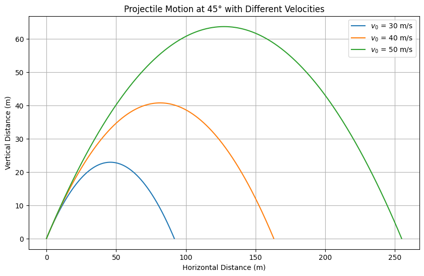
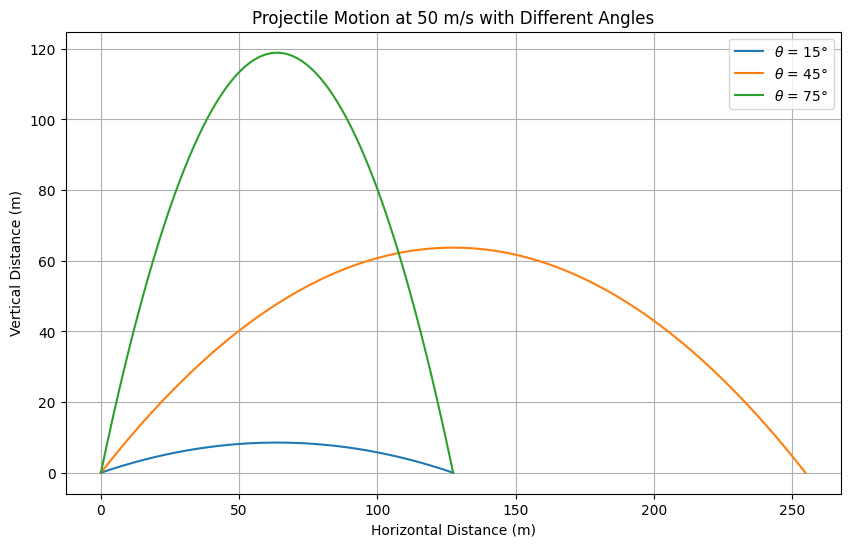

# Problem 1
# Investigating the Range as a Function of the Angle of Projection
## Motivation
Projectile motion, though seemingly simple, presents a deep and rich structure when examined thoroughly. By studying how the range of a projectile depends on the launch angle, we reveal fundamental principles of kinematics and dynamics. Variables like initial velocity, gravitational acceleration, and launch height provide a broad variety of solutions, applicable to real-world situations such as sports, engineering, and space science.

## Theoretical Foundation
Starting from the basic laws of motion, we can derive the projectile equations. Assume no air resistance and flat terrain.

Let:

$v_0$ = Initial velocity

$\theta$ = Angle of projection

$g$ = Gravitational acceleration

The equations of motion are:
$$
\frac{d^2x}{dt^2} = 0 \quad \Rightarrow \quad \frac{dx}{dt} = v_0 \cos(\theta)
$$

$$
\frac{d^2y}{dt^2} = -g \quad \Rightarrow \quad \frac{dy}{dt} = v_0 \sin(\theta) - gt
$$

Integrating these:

$$
x(t) = v_0 \cos(\theta) t
$$

$$
y(t) = v_0 \sin(\theta) t - \frac{1}{2}gt^2
$$

## Time of Flight

Setting $y = 0$ at landing:

$$
0 = v_0 \sin(\theta) T - \frac{1}{2}gT^2
$$

## Solving for T

$$
T = \frac{2v_0 \sin(\theta)}{g}
$$

## Range

Horizontal distance covered:

$$
R = v_0 \cos(\theta) T = \frac{v_0^2 \sin(2\theta)}{g}
$$

## Maximum Height

The maximum vertical position:

$$
H = \frac{v_0^2 \sin^2(\theta)}{2g}
$$
## Observations
Maximum range occurs when $\sin(2\theta) = 1$, that is, $\theta = 45^\circ$

Symmetry: $R(\theta) = R(90^\circ - \theta)$

Effects of parameters
$v_0$: Range increases quadratically with initial velocity.

$g$: Range decreases inversely with gravitational acceleration.

Launch height: Would modify the symmetry and the optimal angle if included.

Practical Applications
Sports: Finding the best launch angles for throws, shots, or kicks.

Engineering: Ballistics calculations.

Astrophysics: Launching satellites or projectiles from planetary surfaces.

Including air resistance, wind, or launching from non-level terrain are real-world complications addressed with numerical methods.

## Implementation
Below are Python scripts simulating projectile motion under the given scenarios.

```python
import numpy as np
import matplotlib.pyplot as plt

def projectile(v0, angle_deg, g=9.81):
    angle_rad = np.radians(angle_deg)
    t_flight = 2 * v0 * np.sin(angle_rad) / g
    t = np.linspace(0, t_flight, num=500)
    x = v0 * np.cos(angle_rad) * t
    y = v0 * np.sin(angle_rad) * t - 0.5 * g * t**2
    return x, y

velocities = [30, 40, 50]
angle = 45

plt.figure(figsize=(10,6))
for v0 in velocities:
    x, y = projectile(v0, angle)
    plt.plot(x, y, label=f'$v_0$ = {v0} m/s')

plt.title("Projectile Motion at 45° with Different Velocities")
plt.xlabel("Horizontal Distance (m)")
plt.ylabel("Vertical Distance (m)")
plt.grid(True)
plt.legend()
plt.show()
```


Scenario 1: 45° angle, different velocities (30, 40, 50 m/s)


```python
import numpy as np
import matplotlib.pyplot as plt

def projectile(v0, angle_deg, g=9.81):
    angle_rad = np.radians(angle_deg)
    t_flight = 2 * v0 * np.sin(angle_rad) / g
    t = np.linspace(0, t_flight, num=500)
    x = v0 * np.cos(angle_rad) * t
    y = v0 * np.sin(angle_rad) * t - 0.5 * g * t**2
    return x, y

velocities = [30, 40, 50]
angle = 45

plt.figure(figsize=(10,6))
for v0 in velocities:
    x, y = projectile(v0, angle)
    plt.plot(x, y, label=f'$v_0$ = {v0} m/s')

plt.title("Projectile Motion at 45° with Different Velocities")
plt.xlabel("Horizontal Distance (m)")
plt.ylabel("Vertical Distance (m)")
plt.grid(True)
plt.legend()
plt.show()
```

Scenario 2: 50 m/s, different angles (15°, 45°, 75°)

```python
angles = [15, 45, 75]
v0 = 50

plt.figure(figsize=(10,6))
for angle in angles:
    x, y = projectile(v0, angle)
    plt.plot(x, y, label=f'$\\theta$ = {angle}°')

plt.title("Projectile Motion at 50 m/s with Different Angles")
plt.xlabel("Horizontal Distance (m)")
plt.ylabel("Vertical Distance (m)")
plt.grid(True)
plt.legend()
plt.show()
Graphical Representations
In the first plot, as initial velocity increases, range increases significantly.
angles = [15, 45, 75]
v0 = 50

plt.figure(figsize=(10,6))
for angle in angles:
    x, y = projectile(v0, angle)
    plt.plot(x, y, label=f'$\\theta$ = {angle}°')

plt.title("Projectile Motion at 50 m/s with Different Angles")
plt.xlabel("Horizontal Distance (m)")
plt.ylabel("Vertical Distance (m)")
plt.grid(True)
plt.legend()
plt.show()
```



In the second plot, $45^\circ$ provides the maximum range, while $15^\circ$ and $75^\circ$ give the same (shorter) range.

## Limitations and Extensions
Limitations
No air resistance considered.

Flat launch and landing height assumed.

Extensions
Include air resistance: drag force proportional to velocity.

Launch from or land on elevated platforms.

Add wind effects.

## Summary
Analyzing projectile motion illustrates fundamental physics while also introducing opportunities for deeper exploration using computational methods. Studying range as a function of launch angle helps us understand both idealized and real-world trajectories.

## Colab Link
Colab - [Problem 1 Simulation](https://colab.research.google.com/drive/1yZDVYnCJ0oDE6Qy4iyeiyP3jnYpd3z0q?usp=sharing)