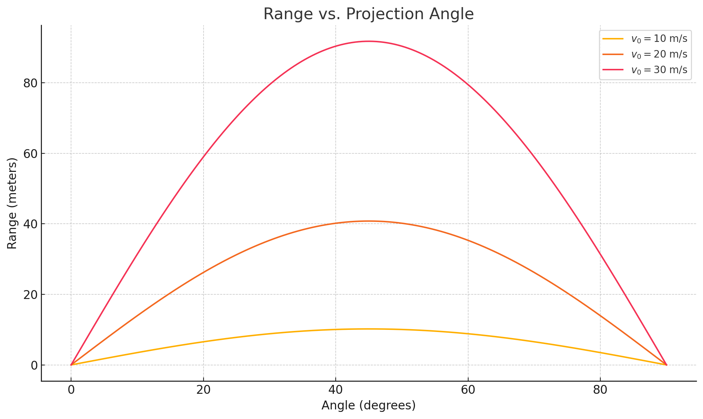

# Investigating the Range as a Function of the Angle of Projection

# Motivation

Projectile motion, though often introduced early in physics education, reveals a rich and complex structure when explored deeply. Understanding how the range of a projectile depends on its angle of projection opens a gateway to mastering core physics principles—especially kinematics and dynamics.

The horizontal range is not only influenced by the angle but also by several key parameters such as initial velocity, gravitational acceleration, and launch height. These parameters provide flexibility for the model to apply in diverse real-world scenarios, ranging from sports trajectories to orbital launches.

# 1. Theoretical Foundation

Governing Equations

Assuming no air resistance and that the projectile is launched and lands at the same height:

Let:

$v_0$: Initial velocity

$\theta$: Angle of projection

$g$: Gravitational acceleration

The velocity components:

$v_{0x} = v_0 \cos(\theta)$

$v_{0y} = v_0 \sin(\theta)$

Time of flight:

Range:

Observations:

Maximum range occurs at $\theta = 45^\circ$

The function $R(\theta)$ is symmetric about $45^\circ$: $R(\theta) = R(90^\circ - \theta)$

Range increases quadratically with $v_0$

Range decreases inversely with $g$

# 2. Analysis of the Range

By varying $\theta$ from $0^\circ$ to $90^\circ$, we observe:

Parabolic relationship

Peak at $45^\circ$

Changes in:

Initial velocity ($v_0$): Quadratic increase in range

Gravitational acceleration ($g$): Inversely proportional effect

Launch height: Adds asymmetry, shifts optimal angle higher than $45^\circ$

# 3. Practical Applications

Real-world considerations include:

Launching from elevated platforms (non-zero launch height)

Air resistance and wind ($F_d = -kv^2$)

Ballistics, sports, and rocket launches

Trajectories on other planets with different $g$

# 4. Implementation (Python Simulation)

import numpy as np
import matplotlib.pyplot as plt

def projectile_range(v0, g=9.81):
    angles_deg = np.linspace(0, 90, 500)
    angles_rad = np.radians(angles_deg)
    ranges = (v0**2) * np.sin(2 * angles_rad) / g
    return angles_deg, ranges

# Simulation for different velocities
velocities = [10, 20, 30]
plt.figure(figsize=(10, 6))

for v0 in velocities:
    angles, ranges = projectile_range(v0)
    plt.plot(angles, ranges, label=f'$v_0 = {v0}$ m/s')
import numpy as np
import matplotlib.pyplot as plt

# Fonksiyon: belirli bir ilk hızla açıya göre menzili hesaplar
def projectile_range(v0, g=9.81):
    angles_deg = np.linspace(0, 90, 500)  # Açıları 0–90 derece arasında al
    angles_rad = np.radians(angles_deg)  # Radyana çevir
    ranges = (v0**2) * np.sin(2 * angles_rad) / g  # Menzil formülü
    return angles_deg, ranges

# Farklı ilk hızlar için simülasyon
velocities = [10, 20, 30]  # m/s
plt.figure(figsize=(10, 6))

for v0 in velocities:
    angles, ranges = projectile_range(v0)
    plt.plot(angles, ranges, label=f'$v_0 = {v0}$ m/s')

# Grafik ayarları
plt.title("Range vs. Projection Angle")
plt.xlabel("Angle (degrees)")
plt.ylabel("Range (meters)")
plt.grid(True)
plt.legend()
plt.tight_layout()
plt.show()

plt.title("Range vs. Projection Angle")
plt.xlabel("Angle (degrees)")
plt.ylabel("Range (meters)")
plt.grid(True)
plt.legend()
plt.tight_layout()
plt.show()
plt.title("Range vs. Projection Angle")
plt.xlabel("Angle (degrees)")
plt.ylabel("Range (meters)")
plt.grid(True)
plt.legend()
plt.tight_layout()
plt.show()

# Simulation for different velocities
velocities = [10, 20, 30]
plt.figure(figsize=(10, 6))

for v0 in velocities:
    angles, ranges = projectile_range(v0)
    plt.plot(angles, ranges, label=f'v0 = {v0} m/s')

plt.title("Range vs. Projection Angle")
plt.xlabel("Angle (degrees)")
plt.ylabel("Range (meters)")
plt.grid(True)
plt.legend()
plt.tight_layout()
plt.show()
# 5. Graphical Interpretation

All curves peak at $\theta = 45^\circ$

Higher $v_0$ values stretch the curve upward

Confirms $R(\theta) = R(90^\circ - \theta)$

# 6. Limitations & Extensions

Limitations:

Ignores air resistance

Assumes flat ground and equal launch/landing height

Extensions:

Include drag force: $F_d = -kv^2$

Numerical solvers (e.g., Euler or Runge-Kutta)

Model different terrains or sloped launches

Consider wind or planetary variations in $g$

# Summary

Projectile motion offers an ideal way to blend theory and computation. By analyzing the range as a function of angle and velocity, we uncover elegant mathematical relationships and useful simulation strategies. These insights find application across fields like sports science, military engineering, and aerospace trajectory planning.

