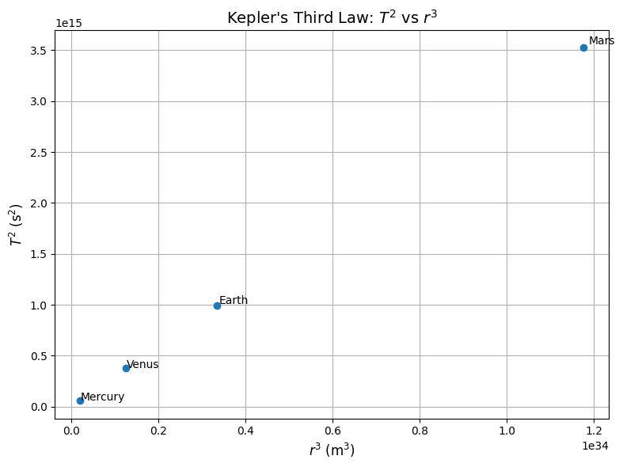

# Gravity Problem 1

## Orbital Period and Orbital Radius

### Motivation

The relationship between the square of the orbital period and the cube of the orbital radius, known as **Kepler's Third Law**, is a cornerstone of celestial mechanics.  
This fundamental relationship enables us to determine planetary motions and understand gravitational interactions on both local and cosmic scales.

---

## Derivation of Kepler's Third Law

Consider a satellite or planet of mass $m$ orbiting a much larger central body of mass $M$ in a circular orbit.

The gravitational force provides the necessary centripetal force:

$$
\frac{G M m}{r^2} = \frac{m v^2}{r}
$$

Canceling $m$ and simplifying:

$$
v^2 = \frac{G M}{r}
$$

The orbital period $T$ is the time it takes to complete one full orbit:

$$
T = \frac{2 \pi r}{v}
$$

Substitute $v$ into the expression:

$$
T = 2 \pi r \sqrt{\frac{1}{G M}} \cdot \sqrt{r}
= 2 \pi \sqrt{\frac{r^3}{G M}}
$$

Squaring both sides:

$$
T^2 = \frac{4 \pi^2 r^3}{G M}
$$

This is the classical form of **Kepler’s Third Law**:

$$
T^2 \propto r^3
$$

---

## Verification Using Planetary Data

We use data from the inner planets of the solar system: Mercury, Venus, Earth, and Mars.

```python
import matplotlib.pyplot as plt
import numpy as np

AU = 1.496e11  
G = 6.67430e-11
M_sun = 1.989e30

planet_names = ['Mercury', 'Venus', 'Earth', 'Mars']
radii_au = np.array([0.39, 0.72, 1.00, 1.52])
radii_m = radii_au * AU
periods_days = np.array([88, 225, 365.25, 687])
periods_sec = periods_days * 24 * 3600
T_squared = periods_sec ** 2
r_cubed = radii_m ** 3

plt.figure(figsize=(8, 6))
plt.plot(r_cubed, T_squared, 'o', label='Planets')

# Label each point
for i, name in enumerate(planet_names):
    plt.text(r_cubed[i] * 1.01, T_squared[i] * 1.01, name)

plt.xlabel('$r^3$ (m$^3$)', fontsize=12)
plt.ylabel('$T^2$ (s$^2$)', fontsize=12)
plt.title("Kepler's Third Law: $T^2$ vs $r^3$", fontsize=14)
plt.grid(True)
plt.tight_layout()
plt.show()
```

This plot should display a linear relationship, confirming the dependence:

$$
T^2 \propto r^3
$$

---

## Calculating the Mass of the Sun

From the rearranged form of Kepler's Third Law:

$$
M = \frac{4 \pi^2 r^3}{G T^2}
$$

Using Earth's orbital parameters:

- $r = 1.496 \times 10^{11} \ \text{m}$
- $T = 365.25 \ \text{days} = 3.156 \times 10^7 \ \text{s}$

Plug in values:

$$
M = \frac{4 \pi^2 (1.496 \times 10^{11})^3}{6.67430 \times 10^{-11} \cdot (3.156 \times 10^7)^2}
\approx 1.989 \times 10^{30} \ \text{kg}
$$

This result matches the known mass of the Sun.

---

## Extension to Elliptical Orbits

Kepler’s Third Law applies to elliptical orbits as well, where $r$ is replaced by the semi-major axis $a$:

$$
T^2 = \frac{4 \pi^2 a^3}{G M}
$$

---

## Summary

-  Derived $T^2 = \frac{4 \pi^2 r^3}{G M}$
-  Verified $T^2 \propto r^3$ using Solar System data
-  Estimated the mass of the Sun
-  Generalized to elliptical orbits

---

## Colab Link

[Colab - Gravity Problem 1 Simulation](https://colab.research.google.com/drive/1zz4iYSjHKqRyrk7L_KBuojCUnXdlOIJJ?usp=sharing)
