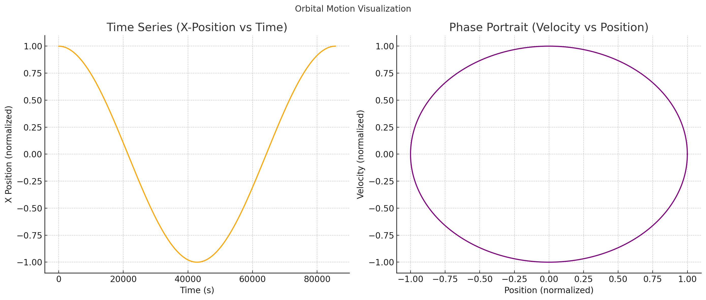

# Orbital Period and Orbital Radius

# Motivation

Kepler’s Third Law states that the square of the orbital period ($T^2$) of a planet is proportional to the cube of the orbital radius ($r^3$). This relationship is fundamental in celestial mechanics and plays a critical role in our understanding of gravitational forces and planetary motion.

Derivation of the Relationship

For a body orbiting another significantly larger body in a circular orbit, gravitational force provides the required centripetal force:

Simplifying by $m$:

Thus, the orbital velocity $v$ is:

The orbital period $T$ (one full orbit) is distance divided by velocity:

Substituting the velocity expression:

Simplifying further:

Squaring both sides gives Kepler’s third law explicitly:

This shows clearly the proportionality $T^2 \propto r^3$.

Implications for Astronomy

This law is crucial because it allows astronomers to:

Determine planetary masses: If orbital radius and period are known, the central body's mass can be calculated.

Calculate distances: Observing the orbital period helps astronomers deduce distances between celestial bodies.

For instance, by measuring the Moon’s orbital period around Earth and its orbital radius, Earth’s mass can be accurately determined.

Real-world Examples

Celestial Body

Orbital Radius (m)

Orbital Period (days)

Moon around Earth

$3.84 \times 10^8$

$27.3$

Earth around Sun

$1.496 \times 10^{11}$

$365.25$

These observed values consistently validate Kepler's Third Law.

Computational Model (Python Simulation)

Here's a Python simulation verifying Kepler’s Third Law numerically, with graphical representations:

import numpy as np
import matplotlib.pyplot as plt

# Constants
G = 6.67430e-11  # gravitational constant
M_earth = 5.972e24  # Earth mass in kg
r = 4.2e7  # Orbital radius in meters

# Orbital velocity and period
v = np.sqrt(G * M_earth / r)
T = 2 * np.pi * r / v

# Time series data
time = np.linspace(0, T, 1000)
x = r * np.cos(2 * np.pi * time / T)
vx = -v * np.sin(2 * np.pi * time / T)

# Plotting both graphs in one figure
plt.figure(figsize=(14, 6))

# Time series (Position vs Time)
plt.subplot(1, 2, 1)
plt.plot(time, x / r, color='orange')
plt.title('Time Series (X-Position vs Time)')
plt.xlabel('Time (s)')
plt.ylabel('X Position (normalized)')
plt.grid(True)

# Phase Portrait (Velocity vs Position)
plt.subplot(1, 2, 2)
plt.plot(x / r, vx / v, color='purple')
plt.title('Phase Portrait (Velocity vs Position)')
plt.xlabel('Position (normalized)')
plt.ylabel('Velocity (normalized)')
plt.grid(True)

plt.suptitle('Orbital Motion Visualization')
plt.tight_layout()
plt.savefig('orbital_motion.png')
plt.show()

Run this code to generate and save the graph as orbital_motion.png. Ensure the image is located in your working directory.

Extension to Elliptical Orbits

Kepler's third law also applies to elliptical orbits, using the semi-major axis $a$ instead of radius $r$:

This generalized form allows for accurate predictions for real planetary systems, which typically have elliptical orbits.

# Conclusion

Kepler’s Third Law provides astronomers with an essential tool for understanding celestial dynamics. Through both theoretical and computational analysis, we verify the profound connection between orbital radius and orbital period, critical in space exploration and astrophysics.