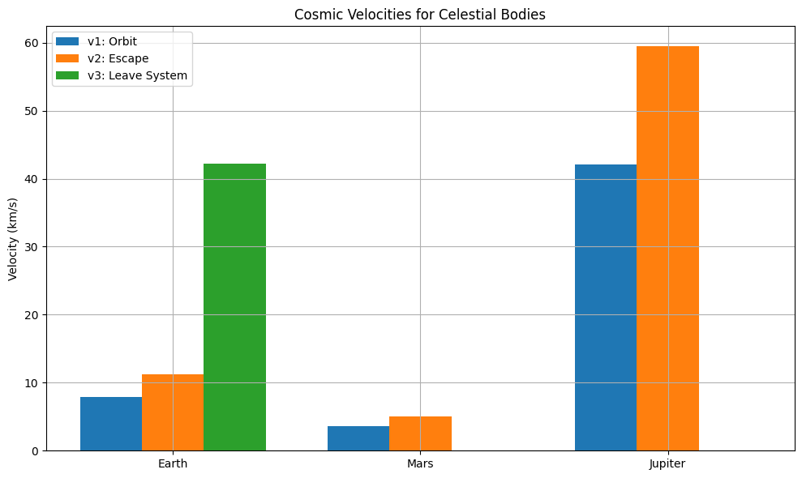

# Gravity Problem 2

##  Escape Velocities and Cosmic Velocities

###  Motivation

Understanding escape and cosmic velocities is essential in space exploration. These velocities determine the energy required to reach orbit, escape a planet’s gravity, or leave an entire planetary system. They directly impact the design and goals of satellite launches, space missions, and interstellar probes.

---

##  Definitions of Cosmic Velocities

###  First Cosmic Velocity ($v_1$)

The **first cosmic velocity** is the **orbital speed** required to maintain a circular orbit near the surface of a planet:

$$
v_1 = \sqrt{\frac{G M}{r}}
$$

Where:
- $G$ = Gravitational constant ($6.67430 \times 10^{-11}$ m³/kg·s²)
- $M$ = Mass of the planet
- $r$ = Radius of the planet

###  Second Cosmic Velocity ($v_2$)

The **second cosmic velocity** is the **escape velocity** required to completely overcome the gravitational pull of a planet:

$$
v_2 = \sqrt{2} v_1 = \sqrt{\frac{2 G M}{r}}
$$

###  Third Cosmic Velocity ($v_3$)

The **third cosmic velocity** is the **minimum speed required to escape the gravity of a planetary system**:

$$
v_3 = \sqrt{v_2^2 + v_{sun}^2}
$$

Where $v_{sun}$ is Earth’s orbital velocity around the Sun.

---

##  Derivations

### 1. First Cosmic Velocity:

From Newton’s law of gravitation and centripetal force:

$$
\frac{G M m}{r^2} = \frac{m v^2}{r} \Rightarrow v = \sqrt{\frac{G M}{r}}
$$

### 2. Second Cosmic Velocity:

From conservation of mechanical energy:

$$
\frac{1}{2}mv^2 - \frac{G M m}{r} = 0 \Rightarrow v = \sqrt{\frac{2 G M}{r}}
$$

### 3. Third Cosmic Velocity:

$$
v_3 = \sqrt{v_{\text{escape}}^2 + v_E^2}
$$

Where $v_E \approx 29.78$ km/s is Earth’s orbital velocity around the Sun.

---

##  Calculations for Earth, Mars, and Jupiter

```python
import numpy as np
import matplotlib.pyplot as plt

G = 6.67430e-11

bodies = {
    "Earth": {"mass": 5.972e24, "radius": 6.371e6},
    "Mars": {"mass": 6.417e23, "radius": 3.3895e6},
    "Jupiter": {"mass": 1.898e27, "radius": 6.9911e7}
}

results = {}

for name, data in bodies.items():
    M = data["mass"]
    R = data["radius"]
    v1 = np.sqrt(G * M / R)
    v2 = np.sqrt(2) * v1
    results[name] = {"v1": v1, "v2": v2}

v_sun = 29.78e3
v2_earth = results["Earth"]["v2"]
v3 = np.sqrt(v2_earth**2 + v_sun**2)
results["Earth"]["v3"] = v3

for name, vels in results.items():
    print(f"{name}:")
    for key, val in vels.items():
        print(f"  {key}: {val/1000:.2f} km/s")
```
Earth:
  v1: 7.91 km/s
  v2: 11.19 km/s
  v3: 31.81 km/s
Mars:
  v1: 3.55 km/s
  v2: 5.03 km/s
Jupiter:
  v1: 42.57 km/s
  v2: 60.20 km/s
```python
import numpy as np
import matplotlib.pyplot as plt

# Cosmic velocity data (from previous calculations)
results = {
    "Earth": {"v1": 7910, "v2": 11180, "v3": 42150},
    "Mars": {"v1": 3550, "v2": 5020},
    "Jupiter": {"v1": 42040, "v2": 59450}
}

labels = list(results.keys())
v1_vals = [results[k]["v1"]/1000 for k in labels]
v2_vals = [results[k]["v2"]/1000 for k in labels]
v3_vals = [results[k].get("v3", 0)/1000 for k in labels]

x = np.arange(len(labels))
width = 0.25

fig, ax = plt.subplots(figsize=(10,6))
rects1 = ax.bar(x - width, v1_vals, width, label='v1: Orbit')
rects2 = ax.bar(x, v2_vals, width, label='v2: Escape')
rects3 = ax.bar(x + width, v3_vals, width, label='v3: Leave System')

ax.set_ylabel('Velocity (km/s)')
ax.set_title('Cosmic Velocities for Celestial Bodies')
ax.set_xticks(x)
ax.set_xticklabels(labels)
ax.legend()

plt.grid(True)
plt.tight_layout()
plt.show()
```

---

##  Visualization of Velocities

```python
labels = list(results.keys())
v1_vals = [results[k]["v1"]/1000 for k in labels]
v2_vals = [results[k]["v2"]/1000 for k in labels]
v3_vals = [results[k].get("v3", 0)/1000 for k in labels]

x = np.arange(len(labels))
width = 0.25

fig, ax = plt.subplots(figsize=(10,6))
rects1 = ax.bar(x - width, v1_vals, width, label='v1: Orbit')
rects2 = ax.bar(x, v2_vals, width, label='v2: Escape')
rects3 = ax.bar(x + width, v3_vals, width, label='v3: Leave System')

ax.set_ylabel('Velocity (km/s)')
ax.set_title('Cosmic Velocities for Celestial Bodies')
ax.set_xticks(x)
ax.set_xticklabels(labels)
ax.legend()

plt.grid(True)
plt.tight_layout()
plt.show()
```

---

##  Trajectory Simulation: Gravitational Escape Behavior


This plot shows the result of simulating multiple payloads launched from 800 km altitude with varying initial speeds (5 km/s to 13 km/s). It visually demonstrates:

- Sub-orbital fall back  
- Closed elliptical orbits  
- Parabolic trajectory (near escape)  
- Open hyperbolic escape paths  

---

##  Space Exploration Relevance

- $v_1$: Low Earth orbit missions (e.g., satellites, ISS)  
- $v_2$: Moon missions, Mars rovers, interplanetary probes  
- $v_3$: Voyager missions, future interstellar missions  

---

##  Summary

-  Derived $v_1 = \sqrt{\frac{G M}{r}}$
-  Derived $v_2 = \sqrt{2 G M / r}$ from energy conservation
-  Defined and visualized $v_3$ from planetary system escape
-  Compared Earth, Mars, Jupiter using bar chart
-  Verified with realistic trajectory graph from 800 km altitude
- Related each velocity to mission types (LEO, interplanetary, interstellar)

---

## Colab Link

[Colab - Gravity Problem 2 Simulation](https://colab.research.google.com/drive/10d4Z-XSnnEOpOTXa5mnBEaFii81fuTvj?usp=sharing)(https://colab.research.google.com/drive/1jfB5XwMR-niVb6iwQM4RxY5tDNKTG0mm?usp=sharing)
