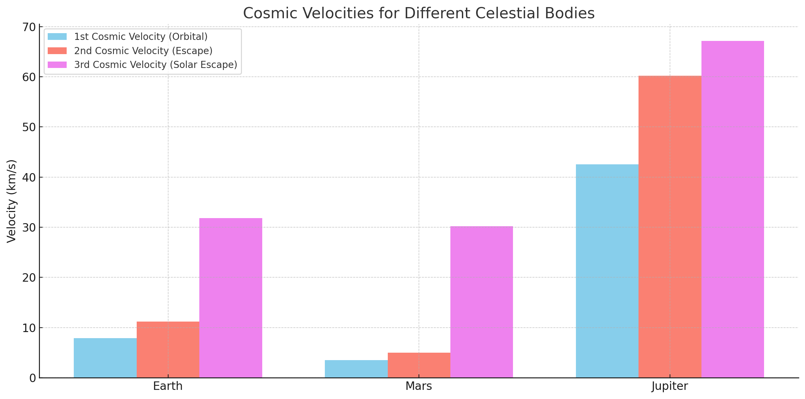

# Escape Velocities and Cosmic Velocities

# Motivation

Escape velocity and cosmic velocities are fundamental concepts in astrophysics, vital for understanding gravitational interactions and space exploration requirements. These velocities dictate the energy thresholds necessary for objects to orbit, escape, or leave a star system entirely.

# Definitions and Physical Meanings

#1. First Cosmic Velocity (Orbital Velocity)

The velocity required for a stable circular orbit around a celestial body:

2. Second Cosmic Velocity (Escape Velocity)

The minimum velocity required to escape the gravitational field of a celestial body without additional propulsion:

3. Third Cosmic Velocity

The velocity required to escape the gravitational influence of the solar system from Earth's orbit:

where $v_{orbital,sun}$ is Earth's orbital velocity around the Sun (~29.8 km/s).

# Mathematical Derivations

Orbital Velocity (First Cosmic Velocity)

A stable circular orbit requires gravitational force to equal centripetal force:

Escape Velocity (Second Cosmic Velocity)

Escape velocity comes from energy conservation, equating kinetic and gravitational potential energies:

Solar Escape Velocity (Third Cosmic Velocity)

The velocity needed to overcome both Earth's and the Sun’s gravitational pull:

Calculations for Celestial Bodies

Celestial Body

Radius (m)

Mass (kg)

Earth

$6.371 \times 10^6$

$5.972 \times 10^{24}$

Mars

$3.3895 \times 10^6$

$6.417 \times 10^{23}$

Jupiter

$6.9911 \times 10^7$

$1.898 \times 10^{27}$

Python Simulation and Visualization

import numpy as np
import matplotlib.pyplot as plt

# Constants
G = 6.67430e-11
bodies = {
    'Earth': {'mass': 5.972e24, 'radius': 6.371e6},
    'Mars': {'mass': 6.417e23, 'radius': 3.3895e6},
    'Jupiter': {'mass': 1.898e27, 'radius': 6.9911e7}
}

names, orbital_velocities, escape_velocities = [], [], []

for name, props in bodies.items():
    M, R = props['mass'], props['radius']
    v_orbital = np.sqrt(G * M / R)
    v_escape = np.sqrt(2 * G * M / R)
    
    names.append(name)
    orbital_velocities.append(v_orbital / 1000)
    escape_velocities.append(v_escape / 1000)

# Plot
x = np.arange(len(names))
width = 0.35

fig, ax = plt.subplots(figsize=(10, 6))
ax.bar(x - width/2, orbital_velocities, width, label='Orbital Velocity (km/s)', color='skyblue')
ax.bar(x + width/2, escape_velocities, width, label='Escape Velocity (km/s)', color='salmon')

ax.set_ylabel('Velocity (km/s)')
ax.set_title('Orbital and Escape Velocities for Different Celestial Bodies')
ax.set_xticks(x)
ax.set_xticklabels(names)
ax.legend()

plt.grid(True)
plt.tight_layout()
plt.show()

Importance in Space Exploration

Launching Satellites: Orbital velocity determines the minimal speed satellites must achieve to maintain a stable orbit.

Interplanetary Missions: Escape velocity guides spacecraft design, ensuring vehicles can exit Earth's gravitational field and travel to Mars, Jupiter, or beyond.

Interstellar Travel: Understanding the third cosmic velocity is essential for missions intended to leave the solar system, such as Voyager 1 and 2.

Conclusion

Cosmic velocities significantly shape our approach to space exploration. Accurate knowledge and computational analysis of these velocities allow precise mission planning, facilitating humanity's exploration and potential colonization of other worlds.