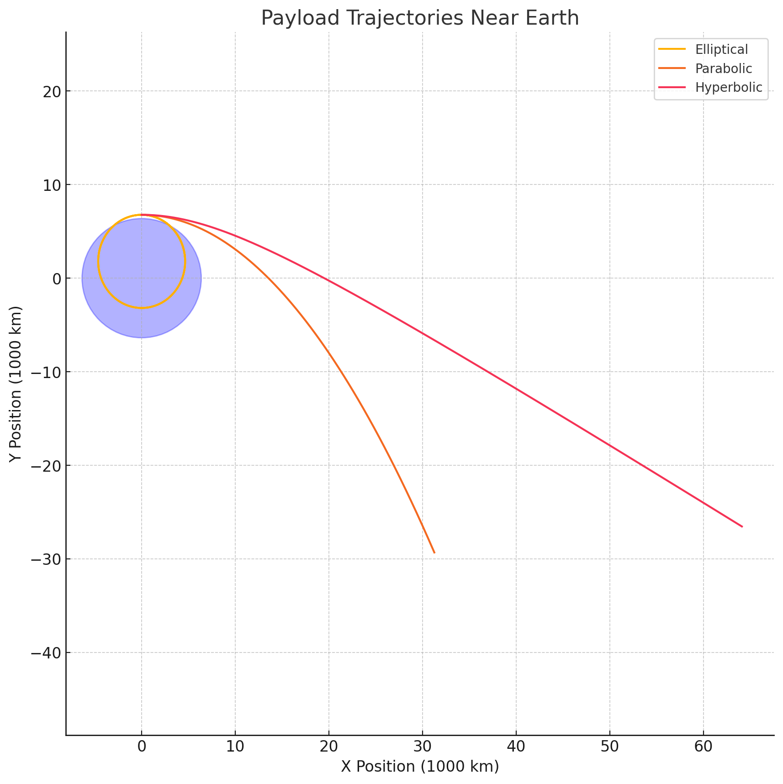

# Trajectories of a Freely Released Payload Near Earth

# Motivation

The trajectory of an object released from a rocket near Earth depends significantly on initial conditions such as position, altitude, and velocity. This problem integrates orbital mechanics and numerical analysis, essential for real-world applications in satellite deployment, orbital insertion, reentry strategies, and space exploration.

# Types of Trajectories

When a payload is released near Earth, its trajectory may take one of three forms:

Elliptical Trajectory: Bound orbit around Earth.

Parabolic Trajectory: Exactly at escape velocity, theoretically escaping Earth’s gravitational influence.

Hyperbolic Trajectory: Exceeding escape velocity, permanently escaping Earth’s gravitational pull.

The type of trajectory depends primarily on the initial velocity relative to Earth's gravitational pull.

Mathematical Analysis

Using Newton’s Law of Universal Gravitation:

Where:

$G$ is gravitational constant

$M$ is mass of Earth

$m$ is payload mass (cancels out in trajectory calculations)

$r$ is distance from Earth’s center

Energy Considerations:

Total mechanical energy determines the trajectory type:

Elliptical: $E < 0$

Parabolic: $E = 0$

Hyperbolic: $E > 0$

Numerical Simulation (Python)

Below is a Python script to numerically simulate and visualize payload trajectories:

import numpy as np
import matplotlib.pyplot as plt
from scipy.integrate import solve_ivp

# Constants
G = 6.67430e-11
M = 5.972e24
R_earth = 6.371e6

# Equations of motion
def equations(t, y):
    r = np.sqrt(y[0]**2 + y[1]**2)
    ax = -G * M * y[0] / r**3
    ay = -G * M * y[1] / r**3
    return [y[2], y[3], ax, ay]

# Initial conditions: altitude (400km) and varying velocities
altitude = 400e3
v_initial = np.sqrt(G*M/(R_earth+altitude))  # Circular orbital speed

# Initial conditions for elliptical, parabolic, hyperbolic trajectories
initial_conditions = [
    (0, R_earth + altitude, 0.8 * v_initial, 0),  # Elliptical
    (0, R_earth + altitude, v_initial*np.sqrt(2), 0),  # Parabolic
    (0, R_earth + altitude, 1.2 * v_initial*np.sqrt(2), 0)  # Hyperbolic
]

labels = ['Elliptical', 'Parabolic', 'Hyperbolic']

plt.figure(figsize=(10,10))

for y0, label in zip(initial_conditions, labels):
    sol = solve_ivp(equations, [0, 8000], y0, max_step=10)
    plt.plot(sol.y[0]/1e6, sol.y[1]/1e6, label=label)

# Earth for visualization
earth = plt.Circle((0, 0), R_earth/1e6, color='blue', alpha=0.3)
plt.gca().add_artist(earth)

plt.xlabel('X Position (1000 km)')
plt.ylabel('Y Position (1000 km)')
plt.title('Payload Trajectories Near Earth')
plt.legend()
plt.axis('equal')
plt.grid(True)
plt.show()

# Real-world Applications

Orbital insertion: Payload velocity adjusted precisely for stable elliptical orbits.

Satellite deployment: Payloads released at calculated velocities to achieve desired trajectories.

Reentry: Adjusting velocities for payloads to safely reenter Earth’s atmosphere.

Interplanetary exploration: Hyperbolic trajectories employed to leave Earth's gravitational influence for missions to other planets.

# Conclusion

Understanding and accurately calculating payload trajectories near Earth are vital in space missions. Numerical methods and simulations are essential tools for predicting and visualizing these trajectories, supporting successful mission outcomes.

