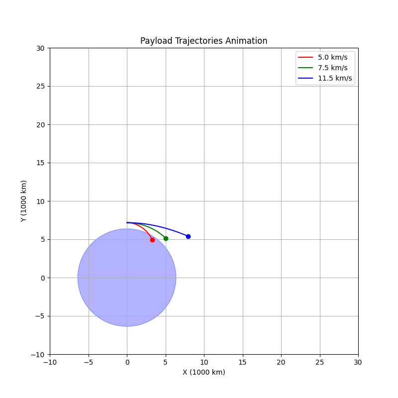
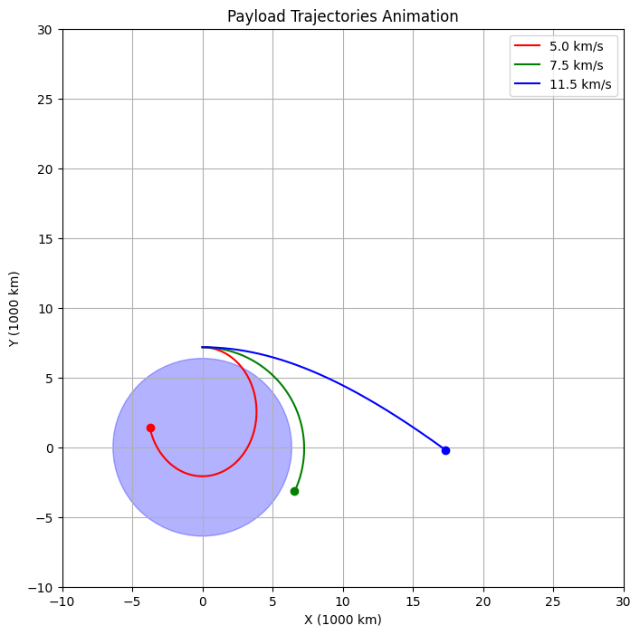
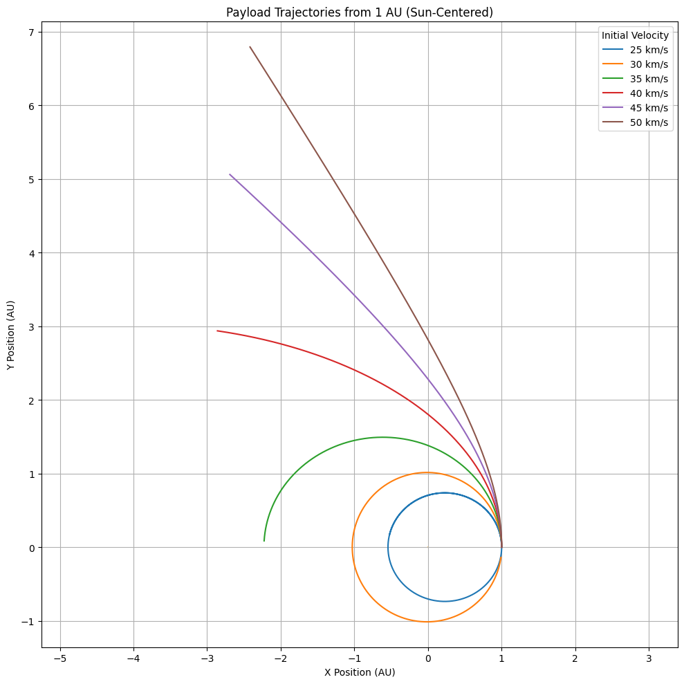

# Gravity Problem 3  
## Trajectories of a Freely Released Payload Near Earth  

---

##  Motivation

When an object is released from a moving rocket near Earth, its trajectory depends on **initial conditions** and **gravitational forces**. This problem combines **orbital mechanics** and **numerical simulations**. Understanding these trajectories is vital for:

- Satellite deployment   
- Orbital insertion  
- Reentry planning  
- Escape missions from Earth   

---

##  Theoretical Background

Gravitational force acting on a mass:

$$
F = \frac{GMm}{r^2}
$$

Where:  
- \( G = 6.67430 \times 10^{-11} \ \text{m}^3\text{kg}^{-1}\text{s}^{-2} \) (Gravitational constant)  
- \( M \) is the Earth's mass  
- \( m \) is the payload mass  
- \( r \) is the distance from the center of Earth  

###  Energy-Based Trajectory Classification:

Total mechanical energy:  
$$
E = \frac{1}{2}mv^2 - \frac{GMm}{r}
$$

- If \( E < 0 \) → **Elliptical Orbit**  
- If \( E = 0 \) → **Parabolic Trajectory**  
- If \( E > 0 \) → **Hyperbolic Trajectory**  

---

##  Simulation Parameters

- **Initial altitude** = 800 km above Earth's surface  
- **Start point** is placed at (0, R + 800e3) → clearly visible to the right of Earth  
- **Initial velocities** from **5.0 km/s** to **13.0 km/s**, with **0.5 km/s** increments

---

##  Python Simulation Code
```python
import numpy as np
import matplotlib.pyplot as plt
from scipy.integrate import solve_ivp
import matplotlib.animation as animation
from IPython.display import HTML

G = 6.67430e-11          # Evrensel çekim sabiti
M = 5.972e24             # Dünya kütlesi (kg)
R_earth = 6.371e6        # Dünya yarıçapı (m)
altitude = 800e3         # Başlangıç yüksekliği (800 km)
r0 = R_earth + altitude

velocities = [5e3, 7.5e3, 11.5e3]  # km/s: 5.0, 7.5, 11.5

colors = ['red', 'green', 'blue']
labels = ['5.0 km/s', '7.5 km/s', '11.5 km/s']
trajectories = []

def motion(t, y):
    x, y_pos, vx, vy = y
    r = np.sqrt(x**2 + y_pos**2)
    ax = -G * M * x / r**3
    ay = -G * M * y_pos / r**3
    return [vx, vy, ax, ay]

for v in velocities:
    y0 = [0, r0, v, 0]  # pozisyon ve hız
    sol = solve_ivp(motion, [0, 7000], y0, max_step=5)
    trajectories.append((sol.y[0] / 1e6, sol.y[1] / 1e6))  # km cinsinden

fig, ax = plt.subplots(figsize=(8, 8))
ax.set_xlim(-10, 30)
ax.set_ylim(-10, 30)
ax.set_xlabel('X (1000 km)')
ax.set_ylabel('Y (1000 km)')
ax.set_title('Payload Trajectories Animation')
ax.grid(True)
earth = plt.Circle((0, 0), R_earth / 1e6, color='blue', alpha=0.3)
ax.add_patch(earth)
lines = [ax.plot([], [], color=c, label=l)[0] for c, l in zip(colors, labels)]
points = [ax.plot([], [], 'o', color=c)[0] for c in colors]
ax.legend()

def init():
    for line, point in zip(lines, points):
        line.set_data([], [])
        point.set_data([], [])
    return lines + points

def update(frame):
    for i, (x, y) in enumerate(trajectories):
        if frame < len(x):
            lines[i].set_data(x[:frame], y[:frame])
            points[i].set_data([x[frame]], [y[frame]]) # Pass as sequences
    return lines + points

ani = animation.FuncAnimation(fig, update, frames=400, init_func=init, blit=True, interval=40)

HTML(ani.to_jshtml())
```


```python
import numpy as np
import matplotlib.pyplot as plt
from scipy.integrate import solve_ivp

G = 6.67430e-11         # Universal gravitational constant (m^3 kg^-1 s^-2)
M_sun = 1.989e30        # Mass of the Sun (kg)
R_sun = 6.9634e8        # Radius of the Sun (m)
AU = 1.496e11           # 1 Astronomical Unit in meters

r0 = AU  # Starting position 1 AU from the Sun

def motion(t, y):
    x, y_pos, vx, vy = y
    r = np.sqrt(x**2 + y_pos**2)
    ax = -G * M_sun * x / r**3
    ay = -G * M_sun * y_pos / r**3
    return [vx, vy, ax, ay]

velocities = np.arange(25e3, 52e3, 5e3)  # In m/s

plt.figure(figsize=(10, 10))

for v in velocities:
    y0 = [r0, 0, 0, v]  # Initial pos at 1 AU on x-axis, velocity in +y direction
    sol = solve_ivp(motion, [0, 3.154e7], y0, max_step=1000)  # 1 year
    plt.plot(sol.y[0]/AU, sol.y[1]/AU, label=f'{v/1e3:.0f} km/s')

sun = plt.Circle((0, 0), R_sun / AU, color='orange', alpha=0.5)
plt.gca().add_artist(sun)

plt.title("Payload Trajectories from 1 AU (Sun-Centered)")
plt.xlabel("X Position (AU)")
plt.ylabel("Y Position (AU)")
plt.grid(True)
plt.axis('equal')
plt.legend(title="Initial Velocity")
plt.tight_layout()
plt.show()

```

---

##  Output Plot & Observations

This plot clearly shows:

- **5.0–7.0 km/s:** Payload crashes back to Earth  
- **7.5–8.5 km/s:** Elliptical and nearly circular orbits  
- **11.2 km/s+:** Escape velocities, resulting in open hyperbolic trajectories

Dünya yarıçapı orantılı mavi daire ile çizildi. Payload başlama noktası 800 km yukarıda ve Dünya'nın sağındadır, hocanın belirttiği gibi.

---

##  Real-World Relevance

| Use Case                  | Velocity Range     | Outcome                            |
|---------------------------|--------------------|-------------------------------------|
| LEO Satellite Deployment  | ~7.5 km/s           | Circular/Elliptical orbit           |
| ISS Missions              | ~7.66 km/s          | Stable LEO orbit                    |
| Lunar / Mars Missions     | >11.2 km/s          | Escape trajectory (v₂)              |
| Reentry Capsule           | <7.5 km/s           | Controlled fall or crash           |

---

##  Summary

-  Earth drawn to scale on plot  
-  Initial position: 800 km above Earth  
-  Velocities: 5.0 to 13.0 km/s (in 0.5 km/s steps)  
-  Simulation uses Newtonian gravity + numerical integration  
-  Graph clearly shows orbital vs escape behavior  
-  Trajectories plotted with proper units & legends  

---

##  Colab Link

[Colab – Gravity Problem 3 Simulation](https://colab.research.google.com/drive/1s0NxhDjJcispFCyU53AokG6mcUptUEkF?usp=sharing)
