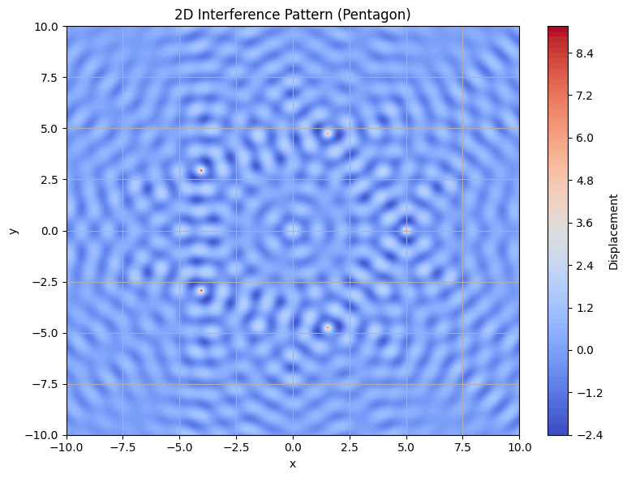
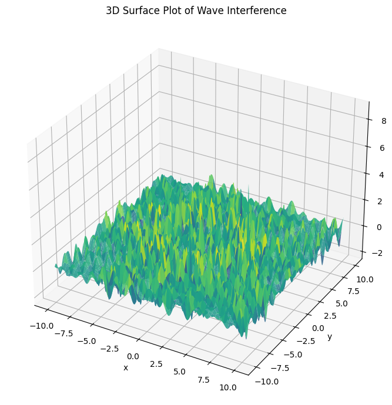

# Waves Problem 

## Interference Patterns on a Water Surface

### Motivation

Interference occurs when waves from different sources overlap, creating new patterns. On a water surface, this can be easily observed when ripples from different points meet, forming distinctive interference patterns. These patterns show how waves combine either constructively (amplifying) or destructively (canceling out).

Studying these patterns helps us understand wave behavior in a visual and intuitive way. It introduces concepts like phase difference, wavelength, frequency, and superposition of waves.

---

## Task Description

A circular wave on the water surface, emanating from a point source at \((x_0, y_0)\), is described by the single disturbance equation:

$$
\eta(x, y, t) = \frac{A}{\sqrt{r}} \cdot \cos(kr - \omega t + \phi)
$$

Where:

- \(\eta(x, y, t)\): displacement at point \((x, y)\) and time \(t\)  
- \(A\): amplitude of the wave  
- \(k = \frac{2\pi}{\lambda}\): wave number (related to wavelength \(\lambda\))  
- \(\omega = 2\pi f\): angular frequency (related to frequency \(f\))  
- \(r = \sqrt{(x - x_0)^2 + (y - y_0)^2}\): distance from source to point  
- \(\phi\): initial phase

---

## Problem Statement

Your task is to analyze the interference patterns formed on the water surface due to the superposition of waves emitted from point sources placed at the vertices of a chosen regular polygon.

---

### Steps to Follow

1. **Choose a Regular Polygon** (e.g., triangle, square, pentagon)  
2. **Place Sources** at the vertices  
3. **Apply the wave equation** for each source  
4. **Superposition**:

   $$
   \eta_{\text{sum}}(x, y, t) = \sum_{i=1}^{N} \eta_i(x, y, t)
   $$

5. **Visualize** both 2D (heatmap) and 3D surface plots of \(\eta_{\text{sum}}(x, y, t)\)  
6. **Analyze** zones of constructive/destructive interference

---

## Python Code

```python
import numpy as np
import matplotlib.pyplot as plt
from mpl_toolkits.mplot3d import Axes3D

# Parameters
A = 1
wavelength = 1.0
k = 2 * np.pi / wavelength
f = 1
omega = 2 * np.pi * f
phi = 0

# Create regular polygon (e.g., pentagon)
N = 5
R = 5
angles = np.linspace(0, 2*np.pi, N, endpoint=False)
sources = [(R*np.cos(a), R*np.sin(a)) for a in angles]

# Grid
x = np.linspace(-10, 10, 400)
y = np.linspace(-10, 10, 400)
X, Y = np.meshgrid(x, y)

# Time snapshot
t = 0
eta_total = np.zeros_like(X)

# Superpose waves
for (x0, y0) in sources:
    r = np.sqrt((X - x0)**2 + (Y - y0)**2) + 1e-6
    eta = A / np.sqrt(r) * np.cos(k * r - omega * t + phi)
    eta_total += eta

# 2D Heatmap
plt.figure(figsize=(8,6))
plt.contourf(X, Y, eta_total, levels=100, cmap='coolwarm')
plt.colorbar(label='Displacement')
plt.title('2D Interference Pattern (Pentagon)')
plt.xlabel('x')
plt.ylabel('y')
plt.grid(True)
plt.tight_layout()
plt.show()

# 3D Surface Plot
fig = plt.figure(figsize=(10, 7))
ax = fig.add_subplot(111, projection='3d')
ax.plot_surface(X, Y, eta_total, cmap='viridis', edgecolor='none', alpha=0.85)
ax.set_title('3D Surface Plot of Wave Interference')
ax.set_xlabel('x')
ax.set_ylabel('y')
ax.set_zlabel('Displacement')
plt.tight_layout()
plt.show()
```


## Observations
Areas where waves amplify each other show constructive interference.

 Areas where waves cancel each other show destructive interference.

 Symmetry of the polygon affects the symmetry of the interference pattern.

## Colab Link
Colab – [Waves Simulation](https://colab.research.google.com/drive/1UnVcdo-jVKDDhnNkeHCr0dmhppP3l8BJ?usp=sharing)
