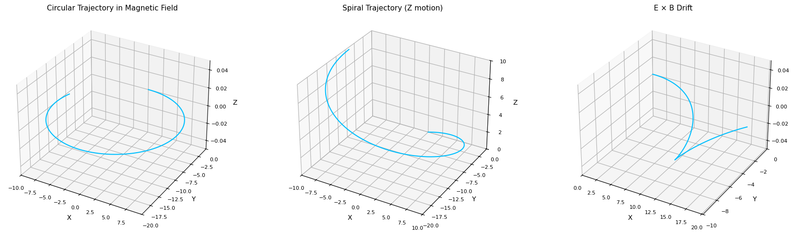

# Electromagnetism Problem 1

## Lorentz Force: Simulating the Motion of Charged Particles

---

### Motivation

The Lorentz force, given by:

$$
\vec{F} = q\vec{E} + q\vec{v} \times \vec{B}
$$

governs the motion of charged particles in electric and magnetic fields. It plays a crucial role in fields like plasma physics, astrophysics, mass spectrometry, and particle accelerators. In this problem, we focus on visualizing circular, spiral, and drift trajectories.

---

## Constants and Setup

We use the following constants for all scenarios:

- Charge: $q = 1$ C
- Mass: $m = 1$ g = 0.001 kg
- Magnetic Field: $\vec{B} = [0, 0, 1]$ T
- Electric Field (if used): $\vec{E} = [0, 5, 0]$ V/m

---

## Equations of Motion

Using Newton's Second Law and the Lorentz force:

$$
\frac{d\vec{v}}{dt} = \frac{q}{m}(\vec{E} + \vec{v} \times \vec{B})
$$

We numerically integrate this using `solve_ivp`.

---

## Python Simulation Code
```python
import numpy as np 
import matplotlib.pyplot as plt
from scipy.integrate import solve_ivp
from mpl_toolkits.mplot3d import Axes3D

# Constants
q = 1       # Charge in Coulombs
m = 1       # Mass in kilograms (1 kg)
B = np.array([0, 0, 1])  # Magnetic field in z-direction
E = np.array([0, 5, 0])  # Electric field in y-direction

# Lorentz force system
def lorentz(t, y, use_electric=False):
    r = y[:3]
    v = y[3:]
    E_field = E if use_electric else np.array([0, 0, 0])
    a = (q / m) * (E_field + np.cross(v, B))
    return np.concatenate((v, a))

# Time settings
dt = 1e-3
n_steps = 5000
T = dt * n_steps
t_eval = np.linspace(0, T, n_steps)

# Define all 3 scenarios
configs = [
    {
        "label": "Circular Trajectory in Magnetic Field",
        "y0": [0, 0, 0, 10, 0, 0],  # Initial velocity in X
        "use_electric": False
    },
    {
        "label": "Spiral Trajectory (Z motion)",
        "y0": [0, 0, 0, 10, 0, 2],  # Initial velocity in X and Z
        "use_electric": False
    },
    {
        "label": "E × B Drift",
        "y0": [0, 0, 0, 10, 0, 0],  # Initial velocity in X, electric field active
        "use_electric": True
    }
]

# Plotting
fig = plt.figure(figsize=(18, 5))

for i, config in enumerate(configs):
    sol = solve_ivp(
        lorentz,
        [0, T],
        config["y0"],
        args=(config["use_electric"],),
        t_eval=t_eval
    )
    x, y, z = sol.y[0], sol.y[1], sol.y[2]

    ax = fig.add_subplot(1, 3, i+1, projection='3d')
    ax.plot(x, y, z, color='deepskyblue', lw=1.5)
    ax.set_title(config["label"], fontsize=11)
    ax.set_xlabel('X')
    ax.set_ylabel('Y')
    ax.set_zlabel('Z')
    ax.tick_params(labelsize=8)
    ax.set_xlim([min(x), max(x)])
    ax.set_ylim([min(y), max(y)])
    ax.set_zlim([min(z), max(z)])
    ax.grid(True)

plt.tight_layout()
plt.show()
```

---

## Visualized Results

- **Circular motion**: Pure rotation in XY-plane under magnetic field only.
- **Spiral motion**: Z-velocity added causes a spiral up.
- **Drift motion**: Crossed E and B fields result in sideways drift.

Each trajectory exhibits expected motion per Lorentz force dynamics.

---

## Real-World Applications

- **Cyclotron**: Particles spiral in a magnetic field.
- **Plasma confinement**: Drift motion used in tokamaks.
- **Mass spectrometry**: Circular/spiral paths reveal charge-to-mass ratio.

---

## Extension Ideas

- Add time-varying fields.
- Use non-uniform magnetic field.
- Animate the particle motion.

---

## Colab Link

[Colab Notebook - Lorentz Force Simulation](https://colab.research.google.com/drive/1NZtXd8Iobkp-_3Ri1UqibfsM6MZX0Zrr?usp=sharing)


