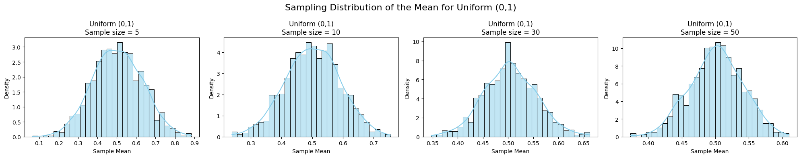
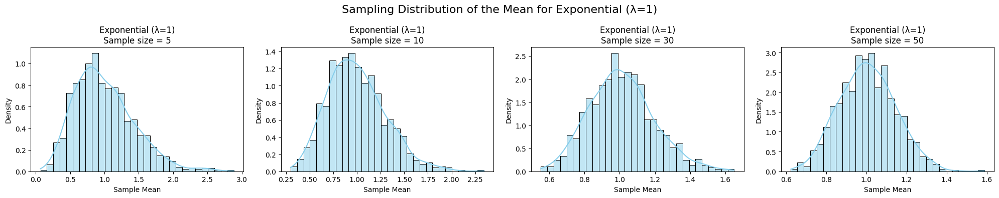
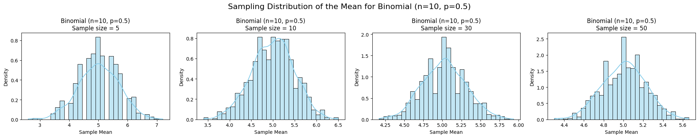

# Statistics Problem 1

##  Exploring the Central Limit Theorem (CLT)

---

###  Motivation

The **Central Limit Theorem (CLT)** states:

> *Regardless of the population distribution, the distribution of the sample mean tends to a normal distribution as the sample size increases.*

This is foundational in statistics and useful in many real-world applications like:

- Estimating population parameters
- Quality control in manufacturing
- Risk modeling in finance

---

##  Objective

We will simulate sampling from various distributions and observe how the sampling distribution of the mean approaches normality as the sample size increases.

---

##  Population Distributions

We will use the following:

- **Uniform Distribution** (0, 1)
- **Exponential Distribution** (λ = 1)
- **Binomial Distribution** (n = 10, p = 0.5)

---

##  Python Code

```python
import numpy as np
import matplotlib.pyplot as plt
import seaborn as sns

def simulate_clt(distribution_func, name, **kwargs):
    np.random.seed(42)
    population = distribution_func(size=100000, **kwargs)

    fig, axes = plt.subplots(1, 4, figsize=(20, 4))
    sample_sizes = [5, 10, 30, 50]

    for i, size in enumerate(sample_sizes):
        sample_means = [np.mean(np.random.choice(population, size)) for _ in range(1000)]
        sns.histplot(sample_means, kde=True, ax=axes[i], stat="density", bins=30, color='skyblue')
        axes[i].set_title(f"{name}\nSample size = {size}")
        axes[i].set_xlabel("Sample Mean")
        axes[i].set_ylabel("Density")

    plt.suptitle(f"Sampling Distribution of the Mean for {name}", fontsize=16)
    plt.tight_layout()
    plt.show()

simulate_clt(np.random.uniform, "Uniform (0,1)", low=0, high=1)
simulate_clt(np.random.exponential, "Exponential (λ=1)", scale=1)
simulate_clt(np.random.binomial, "Binomial (n=10, p=0.5)", n=10, p=0.5)
```




## Observations and Insights
As sample size increases, histograms become more bell-shaped.

Even for skewed distributions (like exponential), the sample mean becomes nearly normal.

CLT works surprisingly well even for n = 30.

Larger sample size → smaller variance of sample mean.
## Definitions
- **Sample Mean (\(\bar{x}\))**: The average of a sample.
- **Sampling Distribution**: The distribution of a statistic (e.g., mean) over repeated samples.
- **Variance of Sample Mean**: \(\frac{\sigma^2}{n}\), where \(\sigma^2\) is the population variance.
- **Population Distribution**: The underlying distribution from which samples are drawn.
- **Skewness**: Asymmetry in the distribution.

## Real-World Applications of CLT
Estimating average weights, heights, or scores from samples.

Quality control processes that rely on sample batch tests.

Predicting average customer behavior in marketing.

Financial forecasts based on sampled historical data.

Designing experiments and interpreting A/B tests.
## Conclusion
The Central Limit Theorem is powerful: regardless of how skewed or irregular the original population is, the distribution of the sample mean tends to normal as sample size increases.

This gives us confidence in using normal-based inference (confidence intervals, hypothesis tests) even when the original data is not normal — as long as the sample size is large enough
##  Colab Link
[Statistics](https://colab.research.google.com/drive/1seiRg-G9yzEN3KzS3bRN1mWxLOTlncoY?usp=sharing)

