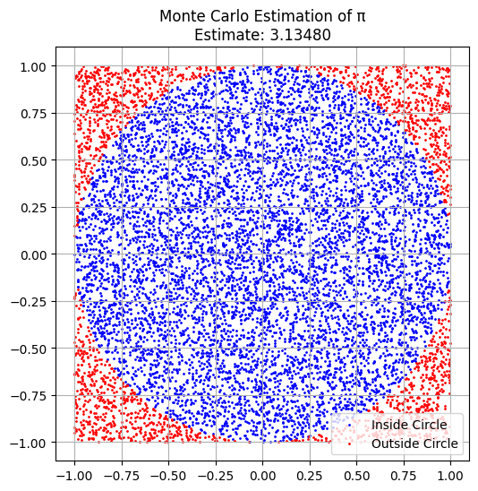

# Statistics Problem 2

##  Estimating π Using Monte Carlo Methods

---

###  Motivation

Monte Carlo simulations are a powerful class of computational techniques that use randomness to solve problems or estimate values. One elegant use case is estimating the value of π through geometric probability. By simulating random events like point placements or needle drops, we can explore how π emerges from probability.

This simulation-based approach connects key concepts in probability, geometry, and computation.

---

## Part 1: Estimating π Using a Circle

###  Theoretical Foundation

If we inscribe a unit circle in a 2x2 square and throw random points in the square, the ratio of points that fall inside the circle to the total number of points approximates the area ratio:

$$
\pi \approx 4 \cdot \frac{\text{Points Inside Circle}}{\text{Total Points}}
$$

###  Simulation Code (Circle)

```python
import numpy as np
import matplotlib.pyplot as plt

np.random.seed(42)
N = 10000
x = np.random.uniform(-1, 1, N)
y = np.random.uniform(-1, 1, N)
dist = np.sqrt(x**2 + y**2)
inside = dist <= 1

pi_estimate = 4 * np.sum(inside) / N
print(f"Estimated π: {pi_estimate:.5f}")

plt.figure(figsize=(6,6))
plt.scatter(x[inside], y[inside], color='blue', s=1, label='Inside Circle')
plt.scatter(x[~inside], y[~inside], color='red', s=1, label='Outside Circle')
plt.title(f'Monte Carlo Estimation of π\nEstimate: {pi_estimate:.5f}')
plt.legend()
plt.gca().set_aspect('equal')
plt.grid(True)
plt.show()
```

###  Visualization

- Blue dots = inside unit circle
- Red dots = outside circle
- As N increases, convergence to π improves

---

## Part 2: Estimating π Using Buffon’s Needle

###  Theoretical Foundation

Buffon's Needle experiment estimates π based on geometric probability:

$$
\pi \approx \frac{2 \cdot L \cdot N}{t \cdot C}
$$

Where:

- L: length of the needle
- t: distance between parallel lines
- N: number of throws
- C: number of crossings

###  Simulation Code (Buffon’s Needle)

```python
import numpy as np

np.random.seed(1)
L = 1.0  # needle length
t = 2.0  # distance between lines
N = 100000
crossings = 0

for _ in range(N):
    center = np.random.uniform(0, t/2)
    angle = np.random.uniform(0, np.pi/2)
    if center <= (L/2)*np.sin(angle):
        crossings += 1

if crossings > 0:
    pi_buffon = (2 * L * N) / (t * crossings)
    print(f"Estimated π via Buffon’s Needle: {pi_buffon:.5f}")
else:
    print("No crossings detected")
Estimated π via Buffon’s Needle: 3.13087
import matplotlib.pyplot as plt
import numpy as np

# Re-run the simulation to store individual needle data for visualization
L = 1.0  # needle length
t = 2.0  # distance between lines
N_viz = 1000 # Reduce N for visualization to avoid overcrowding the plot
crossings_viz = 0
needle_data = [] # Store (center, angle, crossed) for each needle

np.random.seed(1) # Use the same seed for reproducibility

for _ in range(N_viz):
    center = np.random.uniform(0, t/2)
    angle = np.random.uniform(0, np.pi/2)
    crossed = center <= (L/2)*np.sin(angle)
    if crossed:
        crossings_viz += 1
    needle_data.append((center, angle, crossed))

# Create the plot
plt.figure(figsize=(8, 6))

# Draw the lines
plt.axhline(y=0, color='black', linestyle='-')
plt.axhline(y=t/2, color='black', linestyle='-')


# Plot the needles
for center, angle, crossed in needle_data:
    x_start = -L/2 * np.cos(angle)
    y_start = center - L/2 * np.sin(angle)
    x_end = L/2 * np.cos(angle)
    y_end = center + L/2 * np.sin(angle)

    color = 'red' if crossed else 'blue'
    plt.plot([x_start, x_end], [y_start, y_end], color=color, linewidth=0.5)

plt.xlabel("Needle X Position")
plt.ylabel("Needle Y Position (Distance from bottom line)")
plt.title(f"Buffon's Needle Simulation ({N_viz} needles)")
plt.ylim(-L/2, t/2 + L/2) # Adjust y-limits to show the whole needle
plt.xlim(-L/2, L/2) # Adjust x-limits
plt.gca().set_aspect('equal', adjustable='box') # Set aspect ratio to equal
plt.show()

if crossings_viz > 0:
    pi_buffon_viz = (2 * L * N_viz) / (t * crossings_viz)
    print(f"Estimated π via Buffon’s Needle (Visualization subset): {pi_buffon_viz:.5f}")
else:
     print("No crossings detected in visualization subset")
    
```

[Colab](https://colab.research.google.com/drive/1rfh9ZDpudMXHFwhg35HDeX2MsgLWHjk2?usp=sharing)
###  Visualization

You can simulate and visualize needle positions using matplotlib to show how often they cross the lines.

---

##  Observations and Analysis

- **Convergence**: The circle method converges more quickly than Buffon’s Needle.
- **Accuracy**: Buffon’s Needle can be noisy for small sample sizes.
- **Comparison**: Both rely on large N, but geometric randomness in Buffon’s is less efficient.

---

##  Definitions

- **Monte Carlo Simulation**: A method relying on random sampling to compute numerical estimates.
- **Geometric Probability**: Estimation based on spatial geometry and randomness.
- **Convergence**: How fast the simulation estimate approaches the true value.

---

##  Real-World Applications

- Estimating physical constants
- Simulations in finance and risk analysis
- Geometry-based probability models
- Performance benchmarking in numerical algorithms

---

##  Conclusion

Monte Carlo methods are intuitive and powerful for demonstrating how randomness can solve real mathematical problems. Estimating π highlights the role of probability in computation.

---

##  Colab Link

[Colab Notebook - Monte Carlo Estimation of π](https://colab.research.google.com/drive/1IefYh36fLi-Vz7xeE2zcz5RYpTJ3CKfs?usp=sharing)

