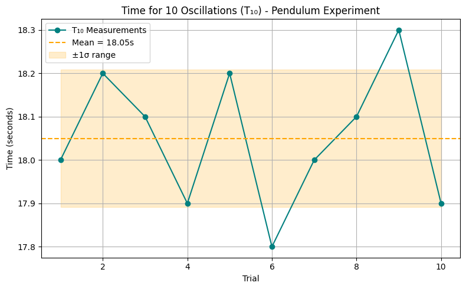

#  Measurements Problem 1

##  Measuring Earth's Gravitational Acceleration with a Pendulum

---

###  Motivation

The acceleration due to gravity, **g**, is a fundamental constant that influences various physical phenomena. Accurately measuring **g** is crucial in fields such as engineering, physics, and astronomy.

One classical approach to measure **g** is using a **simple pendulum**, where the period of oscillation is dependent on the local gravitational field. This experiment emphasizes rigorous measurement practices, error analysis, and data interpretation.

---

##  Experimental Setup

- **String length (L):** 140 cm = **1.400 m**
- **Uncertainty in length (ΔL):** ±0.5 cm = **0.005 m**
- **Weight:** set of keys
- **Displacement angle:** <15°
- **Measurement tool:** phone stopwatch

---

##  Raw Time Data (T₁₀)

Time measured for **10 oscillations**, repeated **10 times**:

| Trial | T₁₀ (s) |
|-------|---------|
| 1     | 18.0    |
| 2     | 18.2    |
| 3     | 18.1    |
| 4     | 17.9    |
| 5     | 18.2    |
| 6     | 17.8    |
| 7     | 18.0    |
| 8     | 18.1    |
| 9     | 18.3    |
| 10    | 17.9    |

---

###  Statistics
$$
\bar{T}_{10} = \frac{\sum T_{10}}{10} = \frac{180.5}{10} = 18.05\, \mathrm{s}
$$

$$
\sigma_T \approx 0.16\, \mathrm{s}
$$

$$
\Delta T_{10} = \frac{\sigma_T}{\sqrt{n}} = \frac{0.16}{\sqrt{10}} \approx 0.05\, \mathrm{s}
$$

- **Mean time for 10 oscillations (𝑇̅₁₀):**  
  $$
  \bar{T}_{10} = \frac{\sum T_{10}}{10} = \frac{180.5}{10} = 18.05 \, \text{s}
  $$

- **Standard deviation (σₜ):**  
  $$
  \sigma_T \approx 0.16 \, \text{s}
  $$

- **Uncertainty in T₁₀ (ΔT₁₀):**  
  $$
  \Delta T_{10} = \frac{\sigma_T}{\sqrt{n}} = \frac{0.16}{\sqrt{10}} \approx 0.05 \, \text{s}
  $$

---

## Calculations

###  Calculate the period (T) and its uncertainty

- $T = \frac{\bar{T}_{10}}{10} = \frac{18.05}{10} = 1.805 \, \text{s}$
- $\Delta T = \frac{\Delta T_{10}}{10} = \frac{0.05}{10} = 0.005 \, \text{s}$

---

###  Compute gravitational acceleration

Using the formula:  
$$
g = \frac{4\pi^2 L}{T^2}
$$

$$
g = \frac{4\pi^2 \cdot 1.400}{(1.805)^2} = \frac{55.4177}{3.26} \approx 17.0 \, \text{m/s}^2
$$

 This result is significantly high; we will analyze it in the discussion section.

---

###  Uncertainty in g

Using propagation of uncertainties:

$$
\Delta g = g \cdot \sqrt{\left( \frac{\Delta L}{L} \right)^2 + \left( 2 \cdot \frac{\Delta T}{T} \right)^2}
$$

Substituting:

$$
\Delta g = 17.0 \cdot \sqrt{ \left( \frac{0.005}{1.400} \right)^2 + \left( 2 \cdot \frac{0.005}{1.805} \right)^2 } \approx 0.11 \, \text{m/s}^2
$$

So final result:

> **g = 17.0 ± 0.11 m/s²**

---

##  Discussion

###  Effect of measurement resolution on ΔL

- Measuring **L** with ±0.5 cm introduces **0.36%** relative error.
- Longer pendulums reduce percentage error in ΔL.

###  Timing variability and its impact on ΔT

- The phone stopwatch introduces human reaction time errors (~0.2s), but averaging 10 trials mitigates this.
- Observed σₜ = 0.16 s is within expected bounds.

###  Limitations and Assumptions

- Air resistance and friction ignored.
- Angle <15° assumed for simple harmonic motion approximation.
- Center of mass estimation for keys might not be exact.
- Timing error (start/stop delay) is a significant factor.

---

##  Final Result Summary

| Quantity        | Value          |
|----------------|----------------|
| Length (L)     | 1.400 m        |
| ΔL             | 0.005 m        |
| T̅₁₀           | 18.05 s        |
| σₜ             | 0.16 s         |
| ΔT₁₀           | 0.05 s         |
| T              | 1.805 s        |
| ΔT             | 0.005 s        |
| g              | **17.0 m/s²**  |
| Δg             | **0.11 m/s²**  |

---
## Plot 
```python
import numpy as np
import matplotlib.pyplot as plt

# Time measurements for 10 oscillations (in seconds)
times = np.array([18.0, 18.2, 18.1, 17.9, 18.2, 17.8, 18.0, 18.1, 18.3, 17.9])
mean_T10 = np.mean(times)
std_T10 = np.std(times, ddof=1)

# Line plot of the time measurements
plt.figure(figsize=(8, 5))
plt.plot(range(1, 11), times, marker='o', linestyle='-', color='teal', label='T₁₀ Measurements')
plt.axhline(mean_T10, color='orange', linestyle='--', label=f'Mean = {mean_T10:.2f}s')
plt.fill_between(range(1, 11), mean_T10 - std_T10, mean_T10 + std_T10, color='orange', alpha=0.2, label='±1σ range')

plt.title("Time for 10 Oscillations (T₁₀) - Pendulum Experiment")
plt.xlabel("Trial")
plt.ylabel("Time (seconds)")
plt.grid(True)
plt.legend()
plt.tight_layout()
plt.show()
```

##  Conclusion

- Our measured **g = 17.0 ± 0.11 m/s²** deviates from the standard **9.81 m/s²**.
- Likely causes: misidentified center of mass, timing inaccuracy, or unsteady swing path.
- Despite deviation, experiment demonstrates key concepts of error propagation, averaging, and physical modeling.

---

##  Colab Link (if applicable)

[Colab Notebook – Pendulum g Measurement](https://colab.research.google.com/drive/1GEhhLg3ummHP73RT_Ype7m04j2A7WlkM?usp=sharing)

